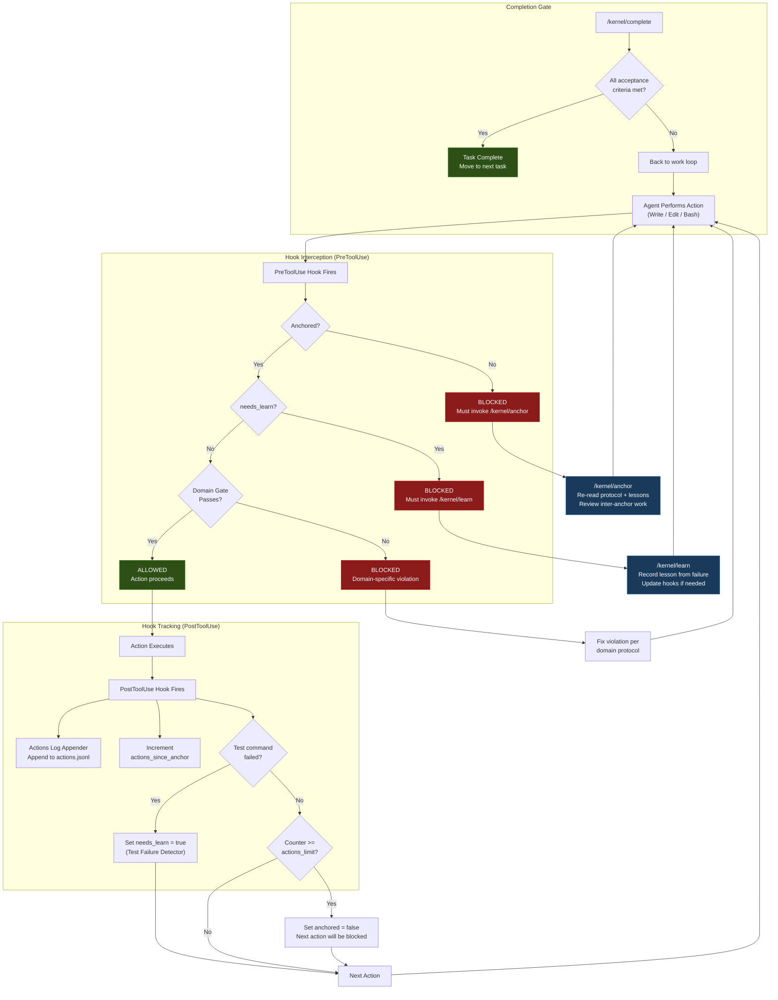

# Enforcement Loop

The step-by-step flow of how the Isagawa Kernel enforces protocol compliance on every agent action. Shows what happens when the agent writes, edits, or runs commands — and how the system self-corrects on failure.

**Audience:** Implementation practitioners

## How It Works

1. **Every action intercepted** — Write, Edit, and Bash all trigger PreToolUse hooks before execution
2. **Three-gate check** — anchored? → needs_learn clear? → domain gates pass?
3. **Block with guidance** — blocked actions tell the agent exactly what command to run to unblock
4. **Post-action tracking** — every action logged, counter incremented, test failures detected
5. **Self-correcting** — failures trigger `/kernel/learn` which updates hooks and protocol to prevent recurrence
6. **Periodic re-centering** — every N actions, the anchor forces a full protocol re-read and work review
