# Integration Architecture

How the Isagawa Kernel integrates with Playwright for governed browser automation. The kernel wraps every browser action with enforcement hooks, creating an audit trail and self-improving test infrastructure.

**Audience:** Browser automation teams, testing platform builders

```mermaid
sequenceDiagram
    participant Dev as Developer / CI
    participant Kernel as Isagawa Kernel
    participant Spec as Domain Spec
    participant Hook as Hook Enforcer
    participant PW as Playwright MCP
    participant Browser as Browser

    Dev->>Kernel: Invoke command<br/>(e.g., run-task.sh)
    Kernel->>Spec: Load domain protocol
    Spec-->>Kernel: Rules, patterns,<br/>anti-patterns

    rect rgb(40, 80, 40)
        Note over Kernel,Browser: Governed Execution Loop
        Kernel->>Hook: PreToolUse check
        Hook-->>Kernel: PASS (anchored, no blocks)
        Kernel->>PW: browser_navigate(url)
        PW->>Browser: Navigate
        Browser-->>PW: Page loaded
        PW-->>Kernel: Result

        Kernel->>Hook: PreToolUse check
        Hook-->>Kernel: PASS
        Kernel->>PW: browser_fill_form(data)
        PW->>Browser: Fill form fields
        Browser-->>PW: Fields filled
        PW-->>Kernel: Result

        Kernel->>Hook: PreToolUse check
        Hook-->>Kernel: PASS
        Kernel->>PW: browser_snapshot()
        PW->>Browser: Capture state
        Browser-->>PW: DOM snapshot
        PW-->>Kernel: Snapshot data
    end

    Note over Hook: PostToolUse fires after each action
    Hook->>Hook: Log to actions.jsonl
    Hook->>Hook: Increment counter

    rect rgb(120, 30, 30)
        Note over Kernel,Hook: Failure Path
        Kernel->>PW: browser_evaluate(assertion)
        PW->>Browser: Run assertion
        Browser-->>PW: FAIL
        PW-->>Kernel: Assertion failed
        Hook->>Hook: Test Failure Detector<br/>sets needs_learn = true
        Kernel->>Kernel: /kernel/learn<br/>Record lesson
        Kernel->>Spec: Update protocol<br/>with new rule
    end

    rect rgb(30, 60, 100)
        Note over Kernel,Hook: Periodic Anchor
        Hook->>Hook: Counter >= limit
        Hook-->>Kernel: BLOCKED
        Kernel->>Kernel: /kernel/anchor
        Kernel->>Spec: Re-read protocol
        Kernel->>Hook: Review actions log
        Hook-->>Kernel: UNBLOCKED
    end
```



## Playwright Integration Points

| Integration Point | Kernel Role | Playwright Role |
|-------------------|-------------|-----------------|
| Navigation | Validates URL against domain rules | Controls browser navigation |
| Form filling | Enforces data patterns from spec | Fills form fields via MCP |
| Assertions | Catches failures, triggers learning | Evaluates JS in browser context |
| Screenshots | Logs as action for audit trail | Captures browser state |
| Network monitoring | Reviews for compliance | Intercepts network requests |
| State snapshots | Stores for anchor review | Captures full DOM state |

## Architecture Layers

```
+--------------------------------------------------+
|  Developer / CI Pipeline                          |
+--------------------------------------------------+
|  Isagawa Kernel (Commands + Skills)               |
|  - session-start → anchor → work → complete       |
|  - task-builder → execute-pipeline → cycling       |
+--------------------------------------------------+
|  Hook Enforcement Layer                           |
|  - PreToolUse: gate check before every action      |
|  - PostToolUse: log, count, detect failures        |
+--------------------------------------------------+
|  Playwright MCP Server                            |
|  - browser_navigate, browser_click, browser_fill   |
|  - browser_snapshot, browser_evaluate              |
+--------------------------------------------------+
|  Browser Instance (Chromium / Firefox / WebKit)   |
+--------------------------------------------------+
```
