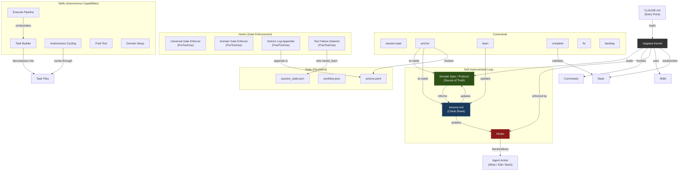

# System Architecture

How all Isagawa Kernel components connect. The kernel is a self-building, self-improving agent framework where the Domain Spec is the source of truth, hooks enforce compliance, and lessons drive continuous improvement.

**Audience:** Architects, technical leads

## Key Relationships

| From | To | Relationship |
|------|-----|-------------|
| CLAUDE.md | Kernel | Loads the kernel into every session |
| Domain Spec | Protocol | Defines rules, patterns, anti-patterns for a domain |
| Hooks | Agent Actions | Block non-compliant actions before execution |
| Actions Log | Anchor | Reviewed every 10 actions for protocol compliance |
| Test Failures | Learn | Trigger mandatory lesson recording |
| Lessons | Hooks + Protocol | Updated after failures to prevent recurrence |
| Task Builder | Task Files | Decomposes goals into atomic, verifiable tasks |
| Execute Pipeline | Task Builder + Cycling | Orchestrates the full backlog-to-done flow |
