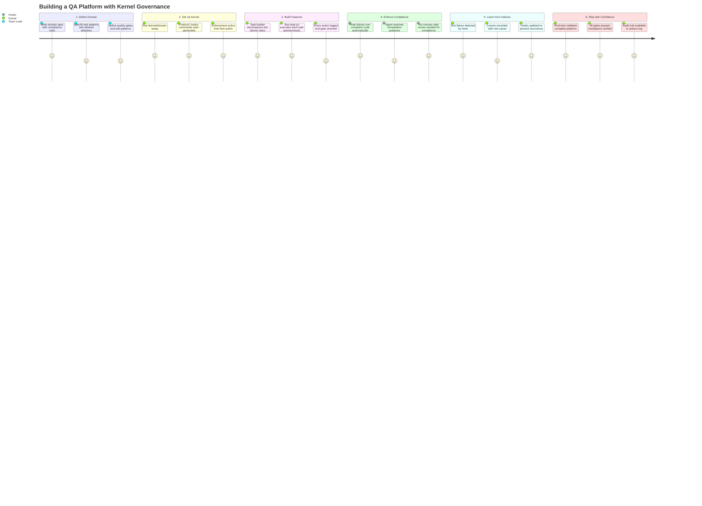
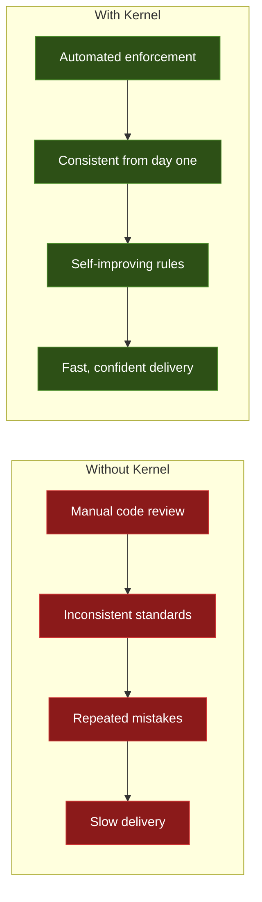

# Use Case Scenario

A real-world walkthrough: building a QA platform with Isagawa Kernel governance. Shows the end-to-end flow from defining a domain to shipping a governed, self-improving automation platform.

**Audience:** Business stakeholders, decision-makers

## Business Value at Each Stage

## Key Outcomes

| Metric | Without Kernel | With Kernel |
|--------|---------------|-------------|
| Compliance enforcement | Manual review (hours) | Automatic (milliseconds) |
| Knowledge retention | Tribal / undocumented | Lessons file + protocol updates |
| Onboarding new agents | Re-learn everything | Inherit all lessons automatically |
| Failure recurrence | Common (same mistakes) | Rare (hooks updated after each) |
| Audit trail | None or manual | Complete (actions.jsonl) |
| Delivery confidence | Uncertain | All gates passed |
